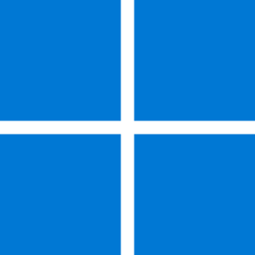

### Olá, meu nome é Amarildo. 👋

Tenho noções de Desenvolvimento Web e ultimamente estou estudando para me tornar um Desenvolvedor FullStack.

<!-- 
Linguagens, tecnologias e ferramentas que tenho(ou tive) contato: HTML5, CSS3, Bootstrap, JavaScript, Python, Django, SQL, Java, Git e GitHub, Visual Studio Code, Linux Ubuntu. 
-->

<!--
**Amarildop1/Amarildop1** is a ✨ _special_ ✨ repository because its `README.md` (this file) appears on your GitHub profile.

Here are some ideas to get you started:

- 🔭 I’m currently working on ...
- 🌱 I’m currently learning ...
- 👯 I’m looking to collaborate on ...
- 🤔 I’m looking for help with ...
- 💬 Ask me about ...
- 📫 How to reach me: ...
- 😄 Pronouns: ...
- ⚡ Fun fact: ...
-->

|  |  |
| ------------- | ------------- | 

 #### :) Linguagens, tecnologias e ferramentas que tenho(ou tive) contato:

<code></code>&nbsp;
<code></code>
<code></code>
<code></code>
<code></code>
<code></code>
<code></code>
<code></code>
<code></code>
<code></code>
<code></code>
<code></code>
<code></code>
<code></code>
<code></code>
<code></code>
<code></code>
<code></code>
<code></code>
<code></code>

 
 <em>Visitas</em> 
  

